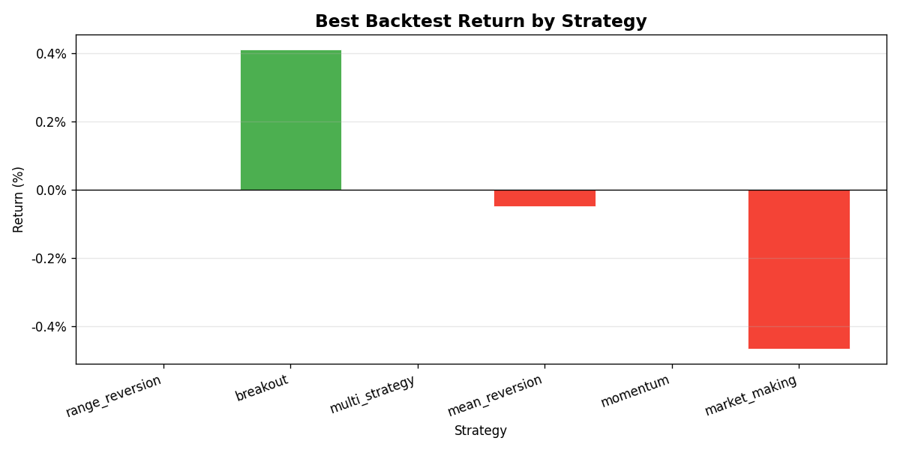

## Trading Analytics Report — Last 30 Days

### Core Metrics

| Metric                  | Value  |
| ----------------------- | ------ |
| Total Trades            | 0      |
| Win Rate                | 0.0%   |
| Total P&L               | +€0.00 |
| Total Fees              | €0.00  |
| Return                  | N/A    |
| Initial Portfolio Value | N/A    |
| Final Portfolio Value   | N/A    |
| Max Drawdown            | 0.00%  |
| Sharpe Ratio            | N/A    |
| Sortino Ratio           | N/A    |
| Profit Factor           | N/A    |

### Backtest Summary

- **Total runs:** 12
- **Profitable runs:** 2 (16.7%)
- **Avg return:** -0.05%
- **Best strategy:** breakout (0.4% return, 100.0% win rate)

### Improvement Suggestions

- No trading data found in the selected window. Run the bot or a backtest first to generate analytics.

### Charts

