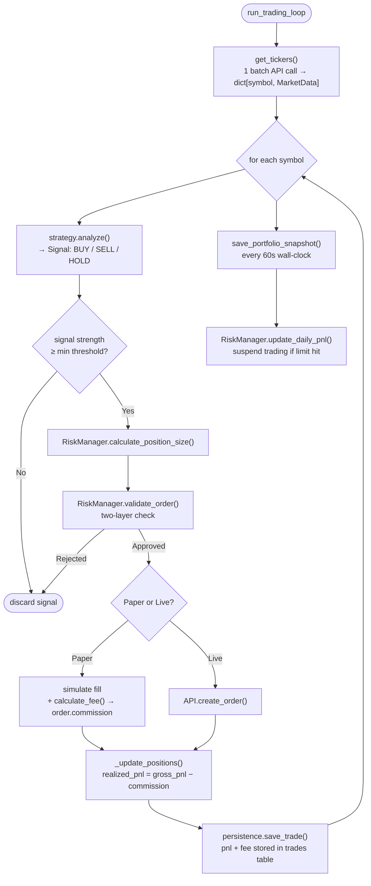
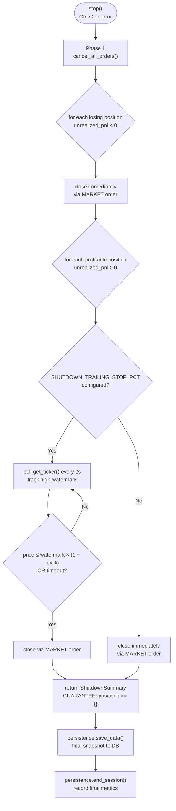

# Architecture

## Component Hierarchy

```mermaid
graph TD
    CLI["cli/run.py\n(entry point)"]
    Bot["TradingBot\nsrc/bot.py"]
    API["RevolutAPIClient\nsrc/api/client.py"]
    MockAPI["MockRevolutAPIClient\nsrc/api/mock_client.py"]
    Rate["RateLimiter\nsrc/utils/rate_limiter.py"]
    Risk["RiskManager\nsrc/risk_management/risk_manager.py"]
    Exec["OrderExecutor\nsrc/execution/executor.py"]
    Strat["BaseStrategy\nsrc/strategies/"]
    Momentum["MomentumStrategy\nEMA(12/26) + RSI"]
    MarketMaking["MarketMakingStrategy\nbid/ask spread"]
    MeanRev["MeanReversionStrategy\nBollinger Bands"]
    Breakout["BreakoutStrategy\nrolling high/low + RSI"]
    RangeRev["RangeReversionStrategy\n24h range + RSI"]
    Multi["MultiStrategy\nweighted voting"]
    DB["DatabasePersistence\nsrc/utils/db_persistence.py"]
    ORM["SQLAlchemy ORM\nsrc/models/db.py"]
    Enc["DatabaseEncryption\nsrc/utils/db_encryption.py"]
    Cfg["Config\nsrc/config.py"]
    OP["1Password\nsrc/utils/onepassword.py"]
    Telegram["TelegramNotifier\nsrc/utils/telegram.py"]
    TelegramCtl["Telegram Control Plane\ncli/telegram_control.py"]

    CLI --> Bot
    CLI --> TelegramCtl
    Bot --> API
    Bot --> MockAPI
    Bot --> Risk
    Bot --> Exec
    Bot --> Strat
    Bot --> DB
    Bot --> Cfg
    Bot --> Telegram
    API --> Rate
    MockAPI --> Rate
    Exec --> API
    Exec --> Risk
    Strat --> Momentum
    Strat --> MarketMaking
    Strat --> MeanRev
    Strat --> Breakout
    Strat --> RangeRev
    Strat --> Multi
    DB --> ORM
    DB --> Enc
    Cfg --> OP
______________________________________________________________________

## Telegram Integration

The bot supports Telegram notifications and an always-on control plane for remote management and analytics report delivery. All Telegram credentials and configuration are stored in 1Password under the trading config item (`revolut-trader-config-{env}`):

- `TELEGRAM_BOT_TOKEN` (concealed): Telegram bot token
- `TELEGRAM_CHAT_ID` (text): Chat ID (user or group)
- `TELEGRAM_REPORTS_ENABLED` (text): Set to `true` to enable analytics/report notifications

**How it works:**
- `src/utils/telegram.py` handles sending notifications, analytics reports (PDF/text), and command polling.
- `cli/telegram_control.py` runs the always-on control plane, allowing you to start/stop the bot and request status/reports via Telegram commands.
- Analytics reports are delivered as PDF (if `fpdf2` is installed) or as a text summary.
- Only the configured chat receives notifications and can control the bot.

See `docs/1PASSWORD.md` for setup instructions.
```

______________________________________________________________________

## Main Data Flow (strategy-dependent interval: 5s / 10s / 15s)



## Graceful Shutdown Flow



______________________________________________________________________

## Per-Strategy Optimizations

Every strategy ships with tuned defaults across four dimensions. All are applied automatically; none require manual configuration.

### Trading Interval

How often the main loop runs. Faster strategies poll more aggressively:

| Strategy        | Interval | Rationale                                   |
| --------------- | -------- | ------------------------------------------- |
| Market Making   | 5s       | Spread opportunities vanish in seconds      |
| Breakout        | 5s       | Price explosions need immediate reaction    |
| Momentum        | 10s      | Trend signals need a few seconds to confirm |
| Multi-Strategy  | 10s      | Consensus voting already smooths noise      |
| Mean Reversion  | 15s      | Reversion unfolds over minutes, not seconds |
| Range Reversion | 15s      | Same as mean reversion — patience pays      |

Override with `--interval N` or `ENVIRONMENT=int uv run python cli/run.py --interval 3`.

### Order Type

Speed-critical strategies use MARKET orders; patient strategies use LIMIT:

| Strategy        | Order Type | Rationale                                   |
| --------------- | ---------- | ------------------------------------------- |
| Market Making   | LIMIT      | Must control the exact spread capture price |
| Momentum        | MARKET     | Speed matters more than price precision     |
| Breakout        | MARKET     | Miss the breakout = miss the trade          |
| Mean Reversion  | LIMIT      | Wait for the fill at the reversion price    |
| Range Reversion | LIMIT      | Same logic as mean reversion                |
| Multi-Strategy  | LIMIT      | Consensus signals are not time-critical     |

### Minimum Signal Strength

Confidence floor [0.0–1.0] below which signals are discarded before any order is placed:

| Strategy        | Min Strength | Rationale                                       |
| --------------- | ------------ | ----------------------------------------------- |
| Market Making   | 0.30         | Small spreads still profitable at low certainty |
| Momentum        | 0.60         | Trend signals need moderate conviction          |
| Breakout        | 0.70         | Breakout false-positives are costly — be sure   |
| Mean Reversion  | 0.50         | Default: moderate confidence required           |
| Range Reversion | 0.50         | Default: moderate confidence required           |
| Multi-Strategy  | 0.55         | Consensus already filters noise slightly        |

### Stop-Loss / Take-Profit Overrides

Applied on top of the risk-level baseline. Reflect each strategy's typical holding period and volatility tolerance. **Position sizing (`max_position_size_pct`) is always controlled by the risk level** — this is intentional so that conservative/moderate/aggressive produce meaningfully different trade sizes in the backtest matrix and in live trading.

| Strategy        | Stop Loss    | Take Profit  | Notes                                |
| --------------- | ------------ | ------------ | ------------------------------------ |
| Market Making   | 0.5%         | 0.3%         | Tight: short-lived spread trades     |
| Momentum        | 2.5%         | 4.0%         | Wider: trends need room to develop   |
| Breakout        | 3.0%         | 5.0%         | Widest: breakouts have large targets |
| Mean Reversion  | 1.0%         | 1.5%         | Tight: if no revert quickly, exit    |
| Range Reversion | 1.0%         | 1.5%         | Same as mean reversion               |
| Multi-Strategy  | *(baseline)* | *(baseline)* | Sub-strategy mix varies too much     |

`*(baseline)*` = value comes from the selected risk level (Conservative / Moderate / Aggressive). Position size always comes from the risk level for every strategy.

______________________________________________________________________

## Key Files

| Layer        | File                                  | Responsibility                                            |
| ------------ | ------------------------------------- | --------------------------------------------------------- |
| Entry        | `cli/run.py`                          | CLI args, starts async loop                               |
| Orchestrator | `src/bot.py`                          | Ties all components together                              |
| Config       | `src/config.py`                       | Pydantic settings, loaded from 1Password                  |
| API          | `src/api/client.py`                   | 17 Revolut X endpoints, Ed25519 auth                      |
| Risk         | `src/risk_management/risk_manager.py` | Position sizing, limits, SL/TP                            |
| Execution    | `src/execution/executor.py`           | Order lifecycle, position tracking                        |
| Strategies   | `src/strategies/`                     | Signal generation                                         |
| Models       | `src/models/domain.py`                | Order, Position, Signal, MarketData                       |
| DB models    | `src/models/db.py`                    | SQLAlchemy ORM (SQLite, WAL mode)                         |
| Persistence  | `src/utils/db_persistence.py`         | All CRUD operations                                       |
| Encryption   | `src/utils/db_encryption.py`          | Fernet encryption, key in 1Password                       |
| Fees         | `src/utils/fees.py`                   | Fee constants + `calculate_fee()` — 0% maker, 0.09% taker |
| Indicators   | `src/utils/indicators.py`             | SMA/EMA/RSI/BB — all O(1) incremental                     |
| Telegram     | `src/utils/telegram.py`               | Telegram notifier, command listener, analytics delivery   |
| TelegramCtl  | `cli/telegram_control.py`             | Always-on Telegram control plane                          |

______________________________________________________________________

## Trading Modes

The bot supports two trading modes, controlled by the `TRADING_MODE` configuration field in 1Password:

### Paper Trading (default)

- Simulates all trades without placing real orders
- Uses real market data from the API
- Tracks P&L, positions, and fills locally
- Safe for testing strategies and validating bot behavior
- **All environments default to paper mode**

### Live Trading (opt-in)

- Places real orders on the Revolut X exchange
- Uses real funds from your account
- Requires explicit configuration: `TRADING_MODE=live` in 1Password
- Triggers confirmation prompt: "Type 'I UNDERSTAND' to proceed"
- Can be overridden per-run with `--mode live` CLI flag

**Key safety principle**: Environment (dev/int/prod) determines *which* credentials and database to use. Trading mode is a *separate* safety setting that defaults to paper everywhere.

### Mode Override

CLI flags can override the 1Password setting:

```bash
revt run --mode paper       # force paper (safe override)
revt run --mode live        # force live (requires confirmation)
revt run --mode live --confirm-live  # skip confirmation (for automation)
```

______________________________________________________________________

## Safety Layers

1. **Two-layer order validation** — sanity check (absolute limits) → risk check (portfolio-relative)
1. **Daily loss limit** — suspends all trading if P&L threshold hit
1. **Stop-loss / take-profit** — auto-closes positions at price levels
1. **No leverage** — order value ≤ portfolio value enforced
1. **Rate limiting** — 200 API calls/min (API allows 1000/min; 200 leaves a 5× safety buffer)
1. **Encrypted DB** — sensitive fields (trading pairs, log messages) encrypted with Fernet key from 1Password
1. **No plaintext files** — logs go to encrypted SQLite, never to disk
1. **Graceful shutdown** — cancels all pending orders, closes losing positions immediately, and closes profitable positions via trailing stop (or immediately); **guarantee: no bot-opened position is left open after shutdown** (EUR → trade → EUR contract)
1. **Pre-existing crypto protection** — SELL guard in `execute_signal` blocks any sell for a symbol the bot did not open; pre-existing crypto is never touched
1. **Currency mismatch validation** — all trading pairs must end with `-{BASE_CURRENCY}`; bot refuses to start if there is a mismatch
1. **Capital cap** — optional `MAX_CAPITAL` in 1Password limits how much the bot can trade with, regardless of account balance
1. **Shutdown trailing stop** — optional `SHUTDOWN_TRAILING_STOP_PCT` and `SHUTDOWN_MAX_WAIT_SECONDS` in 1Password control how long the bot waits for the best exit on profitable positions before force-closing
1. **Telegram notification safety** — only the configured chat can receive notifications and control the bot; credentials are never stored in code or plaintext files
