# Architecture

## Overview

The Revolut Trader bot is a production-ready automated trading system with three-stage deployment (dev → int → prod), comprehensive backtesting, and remote control via Telegram. It supports six trading strategies, three risk levels, and both paper and live trading modes.

## Environments & Data Flow

| Environment | Branch/Tag   | API Client       | Trading Mode         | Use Case                    |
| ----------- | ------------ | ---------------- | -------------------- | --------------------------- |
| `dev`       | feature/\*   | Mock (synthetic) | Paper only           | Local development & testing |
| `int`       | `main`       | Real Revolut X   | Paper only           | Integration testing         |
| `prod`      | release tags | Real Revolut X   | Paper (default)/Live | Production trading          |

Each environment has separate 1Password items for credentials and config, and separate SQLite databases (`revt-data/{env}.db`).

## Component Hierarchy

```mermaid
graph TD
    REVT["revt CLI\ncli/revt.py"]
    RunCLI["cli/commands/run.py"]
    BacktestCLI["cli/commands/backtest.py"]
    AnalyticsCLI["cli/utils/analytics_report.py"]
    TelegramCtl["Telegram Control Plane\ncli/commands/telegram.py"]
    LogsCLI["cli/utils/view_logs.py"]

    Bot["TradingBot\nsrc/bot.py"]
    BacktestEngine["BacktestEngine\nsrc/backtest/engine.py"]

    API["RevolutAPIClient\nsrc/api/client.py"]
    MockAPI["MockRevolutAPIClient\nsrc/api/mock_client.py"]
    Rate["RateLimiter\nsrc/utils/rate_limiter.py"]

    Risk["RiskManager\nsrc/risk_management/risk_manager.py"]
    Exec["OrderExecutor\nsrc/execution/executor.py"]

    Strat["BaseStrategy\nsrc/strategies/base_strategy.py"]
    Momentum["MomentumStrategy"]
    MarketMaking["MarketMakingStrategy"]
    MeanRev["MeanReversionStrategy"]
    Breakout["BreakoutStrategy"]
    RangeRev["RangeReversionStrategy"]
    Multi["MultiStrategy"]

    DB["DatabasePersistence\nsrc/utils/db_persistence.py"]
    ORM["SQLAlchemy ORM\nsrc/models/db.py"]
    Enc["DatabaseEncryption\nsrc/utils/db_encryption.py"]

    Cfg["Config\nsrc/config.py"]
    OP["1Password\nsrc/utils/onepassword.py"]

    Telegram["TelegramNotifier\nsrc/utils/telegram.py"]
    Indicators["Indicators\nsrc/utils/indicators.py"]
    Fees["Fees\nsrc/utils/fees.py"]

    REVT --> RunCLI
    REVT --> BacktestCLI
    REVT --> AnalyticsCLI
    REVT --> TelegramCtl
    REVT --> LogsCLI

    RunCLI --> Bot
    TelegramCtl --> Bot
    BacktestCLI --> BacktestEngine

    Bot --> API
    Bot --> MockAPI
    Bot --> Risk
    Bot --> Exec
    Bot --> Strat
    Bot --> DB
    Bot --> Cfg
    Bot --> Telegram

    BacktestEngine --> Strat
    BacktestEngine --> Risk
    BacktestEngine --> DB
    BacktestEngine --> Indicators
    BacktestEngine --> Fees

    API --> Rate
    MockAPI --> Rate
    Exec --> API
    Exec --> MockAPI
    Exec --> Risk
    Exec --> Fees

    Strat --> Momentum
    Strat --> MarketMaking
    Strat --> MeanRev
    Strat --> Breakout
    Strat --> RangeRev
    Strat --> Multi

    Momentum --> Indicators
    MarketMaking --> Indicators
    MeanRev --> Indicators
    Breakout --> Indicators
    RangeRev --> Indicators
    Multi --> Momentum
    Multi --> MarketMaking
    Multi --> MeanRev
    Multi --> Breakout
    Multi --> RangeRev

    DB --> ORM
    DB --> Enc
    Cfg --> OP
    AnalyticsCLI --> DB
    AnalyticsCLI --> Telegram
    LogsCLI --> DB
    LogsCLI --> Enc
```



______________________________________________________________________

## Risk Levels

Three risk profiles control position sizing, stop-loss/take-profit, and portfolio limits. Configuration is stored in environment-agnostic 1Password items (`revolut-trader-risk-{level}`):

| Parameter              | Conservative | Moderate | Aggressive |
| ---------------------- | ------------ | -------- | ---------- |
| Max Position Size      | 1.5%         | 3%       | 5%         |
| Max Daily Loss         | 3%           | 5%       | 10%        |
| Stop Loss (baseline)   | 1.5%         | 2.5%     | 4.0%       |
| Take Profit (baseline) | 2.5%         | 4.0%     | 7.0%       |
| Max Open Positions     | 3            | 5        | 8          |

**Note:** Per-strategy SL/TP overrides (see below) replace the baseline but **position sizing always comes from the risk level**. This ensures the three profiles produce meaningfully different trade sizes.

______________________________________________________________________

## Telegram Integration

The bot supports push notifications and a two-way control plane for remote management. Telegram credentials are split across two 1Password items:

- `TELEGRAM_BOT_TOKEN` (concealed): Bot token from @BotFather — stored in `revolut-trader-credentials-{env}`
- `TELEGRAM_CHAT_ID` (text): Your user ID or group chat ID — stored in `revolut-trader-config-{env}`

**Features:**

- **Push notifications** — trade fills, errors, daily P&L summaries
- **Analytics delivery** — reports as PDF (requires `fpdf2`) or text summary
- **Command listener** — `/status`, `/balance`, `/report [days]`, `/help`
- **Control plane** — `/run`, `/stop` to start/stop the bot remotely (`cli/commands/telegram.py`)

**Security:** Only the configured `TELEGRAM_CHAT_ID` can send commands or receive notifications. See `docs/1PASSWORD.md` for setup.

______________________________________________________________________

## Main Data Flow (strategy-dependent interval: 5s / 10s / 15s)


## Graceful Shutdown Flow


______________________________________________________________________

## Per-Strategy Optimizations

Every strategy ships with tuned defaults across four dimensions. All are applied automatically; none require manual configuration.

### Trading Interval

How often the main loop runs. Faster strategies poll more aggressively:

| Strategy        | Interval | Rationale                                   |
| --------------- | -------- | ------------------------------------------- |
| Market Making   | 5s       | Spread opportunities vanish in seconds      |
| Breakout        | 5s       | Price explosions need immediate reaction    |
| Momentum        | 10s      | Trend signals need a few seconds to confirm |
| Multi-Strategy  | 10s      | Consensus voting already smooths noise      |
| Mean Reversion  | 15s      | Reversion unfolds over minutes, not seconds |
| Range Reversion | 15s      | Same as mean reversion — patience pays      |

Override globally via 1Password (`INTERVAL` key) or per-run with `revt run --interval N`.

### Order Type

Speed-critical strategies use MARKET orders; patient strategies use LIMIT:

| Strategy        | Order Type | Rationale                                   |
| --------------- | ---------- | ------------------------------------------- |
| Market Making   | LIMIT      | Must control the exact spread capture price |
| Momentum        | MARKET     | Speed matters more than price precision     |
| Breakout        | MARKET     | Miss the breakout = miss the trade          |
| Mean Reversion  | LIMIT      | Wait for the fill at the reversion price    |
| Range Reversion | LIMIT      | Same logic as mean reversion                |
| Multi-Strategy  | LIMIT      | Consensus signals are not time-critical     |

### Minimum Signal Strength

Confidence floor [0.0–1.0] below which signals are discarded before any order is placed:

| Strategy        | Min Strength | Rationale                                       |
| --------------- | ------------ | ----------------------------------------------- |
| Market Making   | 0.30         | Small spreads still profitable at low certainty |
| Momentum        | 0.60         | Trend signals need moderate conviction          |
| Breakout        | 0.70         | Breakout false-positives are costly — be sure   |
| Mean Reversion  | 0.50         | Default: moderate confidence required           |
| Range Reversion | 0.50         | Default: moderate confidence required           |
| Multi-Strategy  | 0.55         | Consensus already filters noise slightly        |

### Stop-Loss / Take-Profit Overrides

Applied on top of the risk-level baseline. Reflect each strategy's typical holding period and volatility tolerance. **Position sizing (`max_position_size_pct`) is always controlled by the risk level** — this is intentional so that conservative/moderate/aggressive produce meaningfully different trade sizes in the backtest matrix and in live trading.

| Strategy        | Stop Loss    | Take Profit  | Notes                                |
| --------------- | ------------ | ------------ | ------------------------------------ |
| Market Making   | 0.5%         | 0.3%         | Tight: short-lived spread trades     |
| Momentum        | 2.5%         | 4.0%         | Wider: trends need room to develop   |
| Breakout        | 3.0%         | 5.0%         | Widest: breakouts have large targets |
| Mean Reversion  | 1.0%         | 1.5%         | Tight: if no revert quickly, exit    |
| Range Reversion | 1.0%         | 1.5%         | Same as mean reversion               |
| Multi-Strategy  | *(baseline)* | *(baseline)* | Sub-strategy mix varies too much     |

`*(baseline)*` = value comes from the selected risk level (Conservative / Moderate / Aggressive). Position size always comes from the risk level for every strategy.

______________________________________________________________________

## Backtesting

The backtest engine (`src/backtest/engine.py`) mirrors live trading with historical candle data:

**Features:**

- **Historical replay** — fetches candles via API, replays price action bar-by-bar
- **Strategy fidelity** — uses same signal generation, risk validation, and order execution logic as live mode
- **Intra-bar SL/TP** — simulates stop-loss and take-profit triggers using candle high/low
- **LIMIT order realism** — only fills LIMIT orders if price crosses the limit; MARKET orders fill at close
- **Fees** — applies 0.09% taker fee (MARKET) and 0% maker fee (LIMIT)
- **Metrics** — total P&L, Sharpe ratio, Sortino ratio, max drawdown, profit factor, win rate

**Available backtests:**

```bash
revt backtest                 # single strategy, 30 days, 1h candles
revt backtest --interval 1    # high-frequency: 1-min candles
revt backtest --compare       # all strategies side-by-side
revt backtest --matrix        # all strategies × all risk levels
```

Results are saved to the encrypted database. View with `revt db backtests` or generate a full report with `revt db report`.

______________________________________________________________________

## Key Files & Components

| Layer         | File                                  | Responsibility                                                    |
| ------------- | ------------------------------------- | ----------------------------------------------------------------- |
| **CLI**       |                                       |                                                                   |
|               | `cli/revt.py`                         | User-facing CLI — production binary entry point                   |
|               | `cli/commands/run.py`                 | Bot runner — starts trading loop                                  |
|               | `cli/commands/telegram.py`            | Always-on Telegram control plane                                  |
|               | `cli/commands/backtest.py`            | Single-strategy backtest                                          |
|               | `cli/commands/backtest_compare.py`    | Multi-strategy comparison & matrix                                |
|               | `cli/utils/analytics_report.py`       | Comprehensive analytics: Sharpe, drawdown, suggestions, charts    |
|               | `cli/utils/view_logs.py`              | View decrypted logs from database                                 |
| **Core**      |                                       |                                                                   |
|               | `src/bot.py`                          | Main orchestrator — ties all components together                  |
|               | `src/config.py`                       | Pydantic settings, loaded from 1Password                          |
| **API**       |                                       |                                                                   |
|               | `src/api/client.py`                   | Real Revolut X API client (Ed25519 auth, 17 endpoints)            |
|               | `src/api/mock_client.py`              | Mock client for dev environment (no network calls)                |
| **Trading**   |                                       |                                                                   |
|               | `src/risk_management/risk_manager.py` | Position sizing, limits, daily loss tracking                      |
|               | `src/execution/executor.py`           | Order lifecycle, position management, graceful shutdown           |
|               | `src/strategies/base_strategy.py`     | Abstract base for all strategies                                  |
|               | `src/strategies/*.py`                 | Six strategy implementations                                      |
|               | `src/backtest/engine.py`              | Backtest engine — mirrors live trading with historical data       |
| **Data**      |                                       |                                                                   |
|               | `src/models/domain.py`                | Domain models (Order, Position, Signal, MarketData, Trade)        |
|               | `src/models/db.py`                    | SQLAlchemy ORM models (SQLite, WAL mode, `Numeric` for money)     |
|               | `src/utils/db_persistence.py`         | All CRUD operations, session management, CSV export               |
|               | `src/utils/db_encryption.py`          | Fernet encryption, key auto-generated in 1Password                |
| **Utilities** |                                       |                                                                   |
|               | `src/utils/onepassword.py`            | 1Password CLI wrapper (environment-aware item resolution)         |
|               | `src/utils/indicators.py`             | Technical indicators (SMA/EMA/RSI/BB) — O(1) incremental          |
|               | `src/utils/rate_limiter.py`           | Token bucket rate limiter (200 calls/min)                         |
|               | `src/utils/fees.py`                   | Trading fee constants + `calculate_fee()` (0% maker, 0.09% taker) |
|               | `src/utils/telegram.py`               | Telegram notifier, command listener, PDF report delivery          |
| **Build**     |                                       |                                                                   |
|               | `build/revt.spec`                     | PyInstaller spec for Linux x86_64 and ARM64 binaries              |

______________________________________________________________________

## Trading Modes

The bot supports two trading modes. Mode is a **separate safety setting from environment** — it controls whether orders are simulated or real.

### Paper Trading (Default)

- **All environments default to paper mode** — safe by design
- Simulates trades locally without API order placement
- Uses real market data from the Revolut X API (or mock in `dev`)
- Tracks P&L, positions, fills, and commissions accurately
- Perfect for strategy validation and bot testing
- `INITIAL_CAPITAL` required (simulated account balance)

### Live Trading (Opt-In)

- **Only allowed in `prod` environment** — attempting live mode in `dev` or `int` fails with clear error
- Places real orders on the Revolut X exchange with real money
- Requires explicit configuration: `TRADING_MODE=live` in 1Password
- Triggers confirmation prompt before starting: `"Type 'I UNDERSTAND' to proceed"`
- Can skip confirmation with `--confirm-live` flag (for automation)
- Fetches real account balance from API (ignores `INITIAL_CAPITAL`)

### Mode Configuration

**Standing default (via 1Password):**

- Set `TRADING_MODE` to `paper` or `live` using `revt config set` (applies to future runs)
- View current setting with `revt config show`

**Per-run override:**

- Use `--mode paper` or `--mode live` to override the 1Password setting for one run
- Live mode requires confirmation (skip with `--confirm-live` for automation)

**Key principle:** Environment selects *which* credentials and database. Trading mode selects *whether* to execute real orders.

______________________________________________________________________

## Safety Layers

### Order Validation (Two-Layer)

1. **Sanity check** — absolute limits (min/max order value, positive quantity)
1. **Risk check** — portfolio-relative limits (position size %, max open positions)

### Portfolio Protection

- **Daily loss limit** — suspends all trading if P&L threshold exceeded
- **Capital cap** — optional `MAX_CAPITAL` limits total trading capital regardless of account balance
- **No leverage** — order value ≤ available cash enforced
- **Position limits** — max open positions per risk level (3/5/8 for conservative/moderate/aggressive)

### Position Management

- **Stop-loss / take-profit** — auto-closes positions at configured price levels
- **Graceful shutdown** — guarantees all bot-opened positions are closed before exit:
  1. Cancel all pending orders
  1. Close losing positions immediately (MARKET orders)
  1. Close profitable positions via trailing stop (if configured) or immediately
- **Pre-existing crypto protection** — SELL guard blocks any sell for symbols the bot didn't open

### Data Security

- **Encrypted database** — sensitive fields (trading pairs, log messages) encrypted with Fernet
- **Key management** — encryption key auto-generated and stored in 1Password
- **No plaintext files** — logs persisted to encrypted SQLite, never written to disk
- **Environment isolation** — separate credentials and databases per environment

### Trading Safety

- **Rate limiting** — 200 API calls/min (5× safety buffer below API's 1000/min limit)
- **Currency validation** — all trading pairs must match `BASE_CURRENCY`; bot refuses to start on mismatch
- **Paper mode default** — all environments default to paper trading; live mode requires explicit opt-in
- **Live mode restrictions** — only allowed in `prod` environment + requires confirmation prompt

### Communication Security

- **Telegram access control** — only configured `TELEGRAM_CHAT_ID` can send commands or receive notifications
- **No credential leakage** — API keys, bot tokens never logged or exposed in error messages
